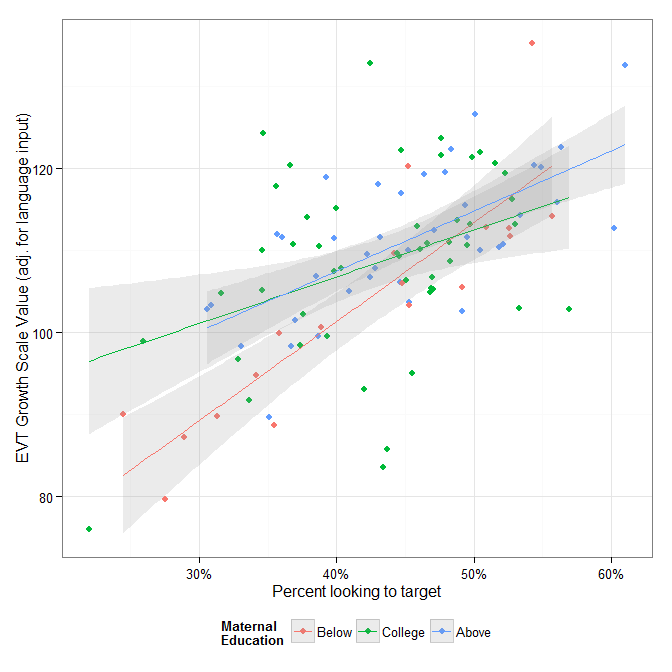
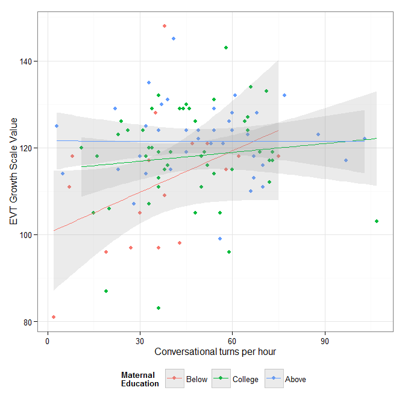

-   Participant Summary
-   Models
-   Poster Plots

*This is an R Markdown document. Markdown is a simple formatting syntax for authoring HTML, PDF, and MS Word documents. For more details on using R Markdown see <http://rmarkdown.rstudio.com>.*

``` {.r}
library("knitr")
opts_chunk$set(echo = FALSE, message = FALSE, warning = FALSE)
opts_knit$set(root.dir = "../")
```

Participant Summary
-------------------

-   108 preschoolers (49 boys, 59 girls), 28--39 months in age

||Below|College|Above|All|
|:--|:----|:------|:----|:--|
|N|18|51|40|109|
|Age (months)|32.89 (3.71)|32.69 (3.50)|32.40 (3.53)|32.61 (3.52)|
|EVT Raw|33.11 (15.89)|40.20 (12.16)|44.23 (10.14)|40.50 (12.63)|
|EVT Standard|109.94 (19.12)|117.37 (14.61)|122.58 (9.44)|118.06 (14.40)|
|LWL Accuracy|41.73 (9.95)|42.97 (7.27)|45.11 (7.78)|43.55 (7.97)|
|EVT Growth Scale Value|111.28 (14.99)|118.00 (11.32)|121.50 (8.58)|118.17 (11.55)|
|Hourly Conversation Turns|34.72 (19.89)|46.24 (18.85)|49.88 (22.35)|45.67 (20.83)|
|Hourly Adult Words|850.72 (399.29)|1020.47 (402.94)|1262.55 (391.99)|1081.28 (422.53)|
|Proportion of Meaningful Speech|0.17 (0.06)|0.20 (0.05)|0.22 (0.05)|0.20 (0.05)|

Models
------

### Processing by Maternal Education

No effect of group on accuracy. A small effect of maternal education emerges when you control for age.

``` {.r}
# Set default table options
stargazer2 <- function(..., type = "html") {
  stargazer(..., type = type, intercept.bottom = FALSE, ci = TRUE, omit.stat = "n")
}

m1 <- lm(Accuracy2 ~ Age2, scores)
m2 <- lm(Accuracy2 ~ MeduC, scores)
m3 <- lm(Accuracy2 ~ MeduC + Age2, scores)
stargazer2(m1, m2, m3)
```

<table style="text-align:center"><tr><td colspan="4" style="border-bottom: 1px solid black"></td></tr><tr><td style="text-align:left"></td><td colspan="3">
<em>Dependent variable:</em>
</td></tr>
<tr><td></td><td colspan="3" style="border-bottom: 1px solid black"></td></tr>
<tr><td style="text-align:left"></td><td colspan="3">
Accuracy2
</td></tr>
<tr><td style="text-align:left"></td><td>
(1)
</td><td>
(2)
</td><td>
(3)
</td></tr>
<tr><td colspan="4" style="border-bottom: 1px solid black"></td></tr><tr><td style="text-align:left">
Constant
</td><td>
0.000
</td><td>
-1.816
</td><td>
-2.052
</td></tr>
<tr><td style="text-align:left"></td><td>
(-1.397, 1.397)
</td><td>
(-5.486, 1.853)
</td><td>
(-5.459, 1.355)
</td></tr>
<tr><td style="text-align:left"></td><td></td><td></td><td></td></tr>
<tr><td style="text-align:left">
Age2
</td><td>
0.839<sup>\*\*\*</sup>
</td><td></td><td>
0.859<sup>\*\*\*</sup>
</td></tr>
<tr><td style="text-align:left"></td><td>
(0.440, 1.238)
</td><td></td><td>
(0.464, 1.255)
</td></tr>
<tr><td style="text-align:left"></td><td></td><td></td><td></td></tr>
<tr><td style="text-align:left">
MeduCCollege
</td><td></td><td>
1.236
</td><td>
1.410
</td></tr>
<tr><td style="text-align:left"></td><td></td><td>
(-3.032, 5.505)
</td><td>
(-2.551, 5.372)
</td></tr>
<tr><td style="text-align:left"></td><td></td><td></td><td></td></tr>
<tr><td style="text-align:left">
MeduCAbove
</td><td></td><td>
3.373
</td><td>
3.794<sup>\*</sup>
</td></tr>
<tr><td style="text-align:left"></td><td></td><td>
(-1.045, 7.792)
</td><td>
(-0.311, 7.898)
</td></tr>
<tr><td style="text-align:left"></td><td></td><td></td><td></td></tr>
<tr><td colspan="4" style="border-bottom: 1px solid black"></td></tr><tr><td style="text-align:left">
R<sup>2</sup>
</td><td>
0.137
</td><td>
0.025
</td><td>
0.169
</td></tr>
<tr><td style="text-align:left">
Adjusted R<sup>2</sup>
</td><td>
0.129
</td><td>
0.007
</td><td>
0.145
</td></tr>
<tr><td style="text-align:left">
Residual Std. Error
</td><td>
7.439 (df = 107)
</td><td>
7.943 (df = 106)
</td><td>
7.371 (df = 105)
</td></tr>
<tr><td style="text-align:left">
F Statistic
</td><td>
16.990<sup>\*\*\*</sup> (df = 1; 107)
</td><td>
1.375 (df = 2; 106)
</td><td>
7.103<sup>\*\*\*</sup> (df = 3; 105)
</td></tr>
<tr><td colspan="4" style="border-bottom: 1px solid black"></td></tr><tr><td style="text-align:left">
<em>Note:</em>
</td><td colspan="3" style="text-align:right">
<sup>*</sup>p\<0.1; <sup>**</sup>p\<0.05; <sup>***</sup>p\<0.01
</td></tr>
</table>


### Processing by Input

``` {.r}
# No effect of input on slope
m4a <- lm(Accuracy2 ~ WordsPerHour2, scores)
m4b <- lm(Accuracy2 ~ Meaningful2, scores)
m4c <- lm(Accuracy2 ~ CTCPerHour2, scores)
stargazer2(m4a, m4b, m4c)
```

<table style="text-align:center"><tr><td colspan="4" style="border-bottom: 1px solid black"></td></tr><tr><td style="text-align:left"></td><td colspan="3">
<em>Dependent variable:</em>
</td></tr>
<tr><td></td><td colspan="3" style="border-bottom: 1px solid black"></td></tr>
<tr><td style="text-align:left"></td><td colspan="3">
Accuracy2
</td></tr>
<tr><td style="text-align:left"></td><td>
(1)
</td><td>
(2)
</td><td>
(3)
</td></tr>
<tr><td colspan="4" style="border-bottom: 1px solid black"></td></tr><tr><td style="text-align:left">
Constant
</td><td>
0.000
</td><td>
0.000
</td><td>
0.000
</td></tr>
<tr><td style="text-align:left"></td><td>
(-1.478, 1.478)
</td><td>
(-1.488, 1.488)
</td><td>
(-1.500, 1.500)
</td></tr>
<tr><td style="text-align:left"></td><td></td><td></td><td></td></tr>
<tr><td style="text-align:left">
WordsPerHour2
</td><td>
0.003<sup>\*</sup>
</td><td></td><td></td></tr>
<tr><td style="text-align:left"></td><td>
(-0.00003, 0.007)
</td><td></td><td></td></tr>
<tr><td style="text-align:left"></td><td></td><td></td><td></td></tr>
<tr><td style="text-align:left">
Meaningful2
</td><td></td><td>
20.960
</td><td></td></tr>
<tr><td style="text-align:left"></td><td></td><td>
(-6.694, 48.620)
</td><td></td></tr>
<tr><td style="text-align:left"></td><td></td><td></td><td></td></tr>
<tr><td style="text-align:left">
CTCPerHour2
</td><td></td><td></td><td>
0.025
</td></tr>
<tr><td style="text-align:left"></td><td></td><td></td><td>
(-0.047, 0.098)
</td></tr>
<tr><td style="text-align:left"></td><td></td><td></td><td></td></tr>
<tr><td colspan="4" style="border-bottom: 1px solid black"></td></tr><tr><td style="text-align:left">
R<sup>2</sup>
</td><td>
0.034
</td><td>
0.020
</td><td>
0.004
</td></tr>
<tr><td style="text-align:left">
Adjusted R<sup>2</sup>
</td><td>
0.025
</td><td>
0.011
</td><td>
-0.005
</td></tr>
<tr><td style="text-align:left">
Residual Std. Error (df = 107)
</td><td>
7.871
</td><td>
7.927
</td><td>
7.990
</td></tr>
<tr><td style="text-align:left">
F Statistic (df = 1; 107)
</td><td>
3.770<sup>\*</sup>
</td><td>
2.207
</td><td>
0.477
</td></tr>
<tr><td colspan="4" style="border-bottom: 1px solid black"></td></tr><tr><td style="text-align:left">
<em>Note:</em>
</td><td colspan="3" style="text-align:right">
<sup>*</sup>p\<0.1; <sup>**</sup>p\<0.05; <sup>***</sup>p\<0.01
</td></tr>
</table>


### Input by Maternal Education

Insignificant difference between college and below-college group in words per hour.

``` {.r}
m4 <- lm(Meaningful2 ~ MeduC, scores)
m5 <- lm(CTCPerHour2 ~ MeduC, scores)
m6 <- lm(WordsPerHour2 ~ MeduC, scores)
stargazer2(m4, m5, m6)
```

<table style="text-align:center"><tr><td colspan="4" style="border-bottom: 1px solid black"></td></tr><tr><td style="text-align:left"></td><td colspan="3">
<em>Dependent variable:</em>
</td></tr>
<tr><td></td><td colspan="3" style="border-bottom: 1px solid black"></td></tr>
<tr><td style="text-align:left"></td><td>
Meaningful2
</td><td>
CTCPerHour2
</td><td>
WordsPerHour2
</td></tr>
<tr><td style="text-align:left"></td><td>
(1)
</td><td>
(2)
</td><td>
(3)
</td></tr>
<tr><td colspan="4" style="border-bottom: 1px solid black"></td></tr><tr><td style="text-align:left">
Constant
</td><td>
-0.035<sup>\*\*\*</sup>
</td><td>
-10.950<sup>\*\*</sup>
</td><td>
-230.600<sup>\*\*</sup>
</td></tr>
<tr><td style="text-align:left"></td><td>
(-0.059, -0.011)
</td><td>
(-20.360, -1.538)
</td><td>
(-414.600, -46.520)
</td></tr>
<tr><td style="text-align:left"></td><td></td><td></td><td></td></tr>
<tr><td style="text-align:left">
MeduCCollege
</td><td>
0.035<sup>\*\*</sup>
</td><td>
11.510<sup>\*\*</sup>
</td><td>
169.700
</td></tr>
<tr><td style="text-align:left"></td><td>
(0.007, 0.063)
</td><td>
(0.568, 22.460)
</td><td>
(-44.310, 383.800)
</td></tr>
<tr><td style="text-align:left"></td><td></td><td></td><td></td></tr>
<tr><td style="text-align:left">
MeduCAbove
</td><td>
0.051<sup>\*\*\*</sup>
</td><td>
15.150<sup>\*\*</sup>
</td><td>
411.800<sup>\*\*\*</sup>
</td></tr>
<tr><td style="text-align:left"></td><td>
(0.023, 0.080)
</td><td>
(3.822, 26.480)
</td><td>
(190.200, 633.400)
</td></tr>
<tr><td style="text-align:left"></td><td></td><td></td><td></td></tr>
<tr><td colspan="4" style="border-bottom: 1px solid black"></td></tr><tr><td style="text-align:left">
R<sup>2</sup>
</td><td>
0.104
</td><td>
0.061
</td><td>
0.128
</td></tr>
<tr><td style="text-align:left">
Adjusted R<sup>2</sup>
</td><td>
0.087
</td><td>
0.044
</td><td>
0.111
</td></tr>
<tr><td style="text-align:left">
Residual Std. Error (df = 106)
</td><td>
0.052
</td><td>
20.370
</td><td>
398.400
</td></tr>
<tr><td style="text-align:left">
F Statistic (df = 2; 106)
</td><td>
6.166<sup>\*\*\*</sup>
</td><td>
3.472<sup>\*\*</sup>
</td><td>
7.750<sup>\*\*\*</sup>
</td></tr>
<tr><td colspan="4" style="border-bottom: 1px solid black"></td></tr><tr><td style="text-align:left">
<em>Note:</em>
</td><td colspan="3" style="text-align:right">
<sup>*</sup>p\<0.1; <sup>**</sup>p\<0.05; <sup>***</sup>p\<0.01
</td></tr>
</table>


### Vocabulary by Maternal Education, Input and Processing

-   Group moderates effect of conversational turns (slopes decrease as maternal education increases, although the interaction is only significant in the high maternal education group).
-   Proportion of meaningful speech is strongest home language predictor

``` {.r}
m07 <- lm(EVT_GSV_T1 ~ MeduC, scores)
m08 <- lm(EVT_GSV_T1 ~ CTCPerHour2, scores)
m09 <- lm(EVT_GSV_T1 ~ CTCPerHour2 * MeduC, scores)
stargazer2(m07, m08, m09)
```

<table style="text-align:center"><tr><td colspan="4" style="border-bottom: 1px solid black"></td></tr><tr><td style="text-align:left"></td><td colspan="3">
<em>Dependent variable:</em>
</td></tr>
<tr><td></td><td colspan="3" style="border-bottom: 1px solid black"></td></tr>
<tr><td style="text-align:left"></td><td colspan="3">
EVT\_GSV\_T1
</td></tr>
<tr><td style="text-align:left"></td><td>
(1)
</td><td>
(2)
</td><td>
(3)
</td></tr>
<tr><td colspan="4" style="border-bottom: 1px solid black"></td></tr><tr><td style="text-align:left">
Constant
</td><td>
111.300<sup>\*\*\*</sup>
</td><td>
118.200<sup>\*\*\*</sup>
</td><td>
114.700<sup>\*\*\*</sup>
</td></tr>
<tr><td style="text-align:left"></td><td>
(106.100, 116.400)
</td><td>
(116.000, 120.300)
</td><td>
(108.900, 120.600)
</td></tr>
<tr><td style="text-align:left"></td><td></td><td></td><td></td></tr>
<tr><td style="text-align:left">
MeduCCollege
</td><td>
6.722<sup>\*\*</sup>
</td><td></td><td>
3.215
</td></tr>
<tr><td style="text-align:left"></td><td>
(0.748, 12.700)
</td><td></td><td>
(-3.329, 9.759)
</td></tr>
<tr><td style="text-align:left"></td><td></td><td></td><td></td></tr>
<tr><td style="text-align:left">
MeduCAbove
</td><td>
10.220<sup>\*\*\*</sup>
</td><td></td><td>
6.759<sup>\*</sup>
</td></tr>
<tr><td style="text-align:left"></td><td>
(4.038, 16.410)
</td><td></td><td>
(-0.002, 13.520)
</td></tr>
<tr><td style="text-align:left"></td><td></td><td></td><td></td></tr>
<tr><td style="text-align:left">
CTCPerHour2:MeduCCollege
</td><td></td><td></td><td>
-0.249
</td></tr>
<tr><td style="text-align:left"></td><td></td><td></td><td>
(-0.556, 0.058)
</td></tr>
<tr><td style="text-align:left"></td><td></td><td></td><td></td></tr>
<tr><td style="text-align:left">
CTCPerHour2:MeduCAbove
</td><td></td><td></td><td>
-0.318<sup>\*\*</sup>
</td></tr>
<tr><td style="text-align:left"></td><td></td><td></td><td>
(-0.622, -0.015)
</td></tr>
<tr><td style="text-align:left"></td><td></td><td></td><td></td></tr>
<tr><td style="text-align:left">
CTCPerHour2
</td><td></td><td>
0.111<sup>\*\*</sup>
</td><td>
0.317<sup>\*\*</sup>
</td></tr>
<tr><td style="text-align:left"></td><td></td><td>
(0.008, 0.214)
</td><td>
(0.055, 0.579)
</td></tr>
<tr><td style="text-align:left"></td><td></td><td></td><td></td></tr>
<tr><td colspan="4" style="border-bottom: 1px solid black"></td></tr><tr><td style="text-align:left">
R<sup>2</sup>
</td><td>
0.090
</td><td>
0.040
</td><td>
0.143
</td></tr>
<tr><td style="text-align:left">
Adjusted R<sup>2</sup>
</td><td>
0.073
</td><td>
0.031
</td><td>
0.101
</td></tr>
<tr><td style="text-align:left">
Residual Std. Error
</td><td>
11.120 (df = 106)
</td><td>
11.370 (df = 107)
</td><td>
10.950 (df = 103)
</td></tr>
<tr><td style="text-align:left">
F Statistic
</td><td>
5.259<sup>\*\*\*</sup> (df = 2; 106)
</td><td>
4.501<sup>\*\*</sup> (df = 1; 107)
</td><td>
3.432<sup>\*\*\*</sup> (df = 5; 103)
</td></tr>
<tr><td colspan="4" style="border-bottom: 1px solid black"></td></tr><tr><td style="text-align:left">
<em>Note:</em>
</td><td colspan="3" style="text-align:right">
<sup>*</sup>p\<0.1; <sup>**</sup>p\<0.05; <sup>***</sup>p\<0.01
</td></tr>
</table>

``` {.r}
m10 <- lm(EVT_GSV_T1 ~ Meaningful2, scores)
m11 <- lm(EVT_GSV_T1 ~ Meaningful2 * MeduC, scores)
stargazer2(m07, m10, m11)
```

<table style="text-align:center"><tr><td colspan="4" style="border-bottom: 1px solid black"></td></tr><tr><td style="text-align:left"></td><td colspan="3">
<em>Dependent variable:</em>
</td></tr>
<tr><td></td><td colspan="3" style="border-bottom: 1px solid black"></td></tr>
<tr><td style="text-align:left"></td><td colspan="3">
EVT\_GSV\_T1
</td></tr>
<tr><td style="text-align:left"></td><td>
(1)
</td><td>
(2)
</td><td>
(3)
</td></tr>
<tr><td colspan="4" style="border-bottom: 1px solid black"></td></tr><tr><td style="text-align:left">
Constant
</td><td>
111.300<sup>\*\*\*</sup>
</td><td>
118.200<sup>\*\*\*</sup>
</td><td>
115.600<sup>\*\*\*</sup>
</td></tr>
<tr><td style="text-align:left"></td><td>
(106.100, 116.400)
</td><td>
(116.100, 120.200)
</td><td>
(109.900, 121.300)
</td></tr>
<tr><td style="text-align:left"></td><td></td><td></td><td></td></tr>
<tr><td style="text-align:left">
MeduCCollege
</td><td>
6.722<sup>\*\*</sup>
</td><td></td><td>
2.453
</td></tr>
<tr><td style="text-align:left"></td><td>
(0.748, 12.700)
</td><td></td><td>
(-3.951, 8.856)
</td></tr>
<tr><td style="text-align:left"></td><td></td><td></td><td></td></tr>
<tr><td style="text-align:left">
MeduCAbove
</td><td>
10.220<sup>\*\*\*</sup>
</td><td></td><td>
5.533
</td></tr>
<tr><td style="text-align:left"></td><td>
(4.038, 16.410)
</td><td></td><td>
(-1.151, 12.220)
</td></tr>
<tr><td style="text-align:left"></td><td></td><td></td><td></td></tr>
<tr><td style="text-align:left">
Meaningful2:MeduCCollege
</td><td></td><td></td><td>
-65.330
</td></tr>
<tr><td style="text-align:left"></td><td></td><td></td><td>
(-165.100, 34.470)
</td></tr>
<tr><td style="text-align:left"></td><td></td><td></td><td></td></tr>
<tr><td style="text-align:left">
Meaningful2:MeduCAbove
</td><td></td><td></td><td>
-95.730<sup>\*</sup>
</td></tr>
<tr><td style="text-align:left"></td><td></td><td></td><td>
(-203.900, 12.400)
</td></tr>
<tr><td style="text-align:left"></td><td></td><td></td><td></td></tr>
<tr><td style="text-align:left">
Meaningful2
</td><td></td><td>
75.990<sup>\*\*\*</sup>
</td><td>
121.100<sup>\*\*\*</sup>
</td></tr>
<tr><td style="text-align:left"></td><td></td><td>
(38.160, 113.800)
</td><td>
(39.690, 202.600)
</td></tr>
<tr><td style="text-align:left"></td><td></td><td></td><td></td></tr>
<tr><td colspan="4" style="border-bottom: 1px solid black"></td></tr><tr><td style="text-align:left">
R<sup>2</sup>
</td><td>
0.090
</td><td>
0.127
</td><td>
0.189
</td></tr>
<tr><td style="text-align:left">
Adjusted R<sup>2</sup>
</td><td>
0.073
</td><td>
0.118
</td><td>
0.150
</td></tr>
<tr><td style="text-align:left">
Residual Std. Error
</td><td>
11.120 (df = 106)
</td><td>
10.840 (df = 107)
</td><td>
10.650 (df = 103)
</td></tr>
<tr><td style="text-align:left">
F Statistic
</td><td>
5.259<sup>\*\*\*</sup> (df = 2; 106)
</td><td>
15.500<sup>\*\*\*</sup> (df = 1; 107)
</td><td>
4.811<sup>\*\*\*</sup> (df = 5; 103)
</td></tr>
<tr><td colspan="4" style="border-bottom: 1px solid black"></td></tr><tr><td style="text-align:left">
<em>Note:</em>
</td><td colspan="3" style="text-align:right">
<sup>*</sup>p\<0.1; <sup>**</sup>p\<0.05; <sup>***</sup>p\<0.01
</td></tr>
</table>

``` {.r}
m12 <- lm(EVT_GSV_T1 ~ WordsPerHour2, scores)
m13 <- lm(EVT_GSV_T1 ~ WordsPerHour2 * MeduC, scores)
stargazer2(m07, m12, m13)
```

<table style="text-align:center"><tr><td colspan="4" style="border-bottom: 1px solid black"></td></tr><tr><td style="text-align:left"></td><td colspan="3">
<em>Dependent variable:</em>
</td></tr>
<tr><td></td><td colspan="3" style="border-bottom: 1px solid black"></td></tr>
<tr><td style="text-align:left"></td><td colspan="3">
EVT\_GSV\_T1
</td></tr>
<tr><td style="text-align:left"></td><td>
(1)
</td><td>
(2)
</td><td>
(3)
</td></tr>
<tr><td colspan="4" style="border-bottom: 1px solid black"></td></tr><tr><td style="text-align:left">
Constant
</td><td>
111.300<sup>\*\*\*</sup>
</td><td>
118.200<sup>\*\*\*</sup>
</td><td>
114.700<sup>\*\*\*</sup>
</td></tr>
<tr><td style="text-align:left"></td><td>
(106.100, 116.400)
</td><td>
(116.100, 120.200)
</td><td>
(108.900, 120.500)
</td></tr>
<tr><td style="text-align:left"></td><td></td><td></td><td></td></tr>
<tr><td style="text-align:left">
MeduCCollege
</td><td>
6.722<sup>\*\*</sup>
</td><td></td><td>
3.754
</td></tr>
<tr><td style="text-align:left"></td><td>
(0.748, 12.700)
</td><td></td><td>
(-2.795, 10.300)
</td></tr>
<tr><td style="text-align:left"></td><td></td><td></td><td></td></tr>
<tr><td style="text-align:left">
MeduCAbove
</td><td>
10.220<sup>\*\*\*</sup>
</td><td></td><td>
6.492<sup>\*</sup>
</td></tr>
<tr><td style="text-align:left"></td><td>
(4.038, 16.410)
</td><td></td><td>
(-0.407, 13.390)
</td></tr>
<tr><td style="text-align:left"></td><td></td><td></td><td></td></tr>
<tr><td style="text-align:left">
WordsPerHour2:MeduCCollege
</td><td></td><td></td><td>
-0.008
</td></tr>
<tr><td style="text-align:left"></td><td></td><td></td><td>
(-0.023, 0.007)
</td></tr>
<tr><td style="text-align:left"></td><td></td><td></td><td></td></tr>
<tr><td style="text-align:left">
WordsPerHour2:MeduCAbove
</td><td></td><td></td><td>
-0.013
</td></tr>
<tr><td style="text-align:left"></td><td></td><td></td><td>
(-0.028, 0.003)
</td></tr>
<tr><td style="text-align:left"></td><td></td><td></td><td></td></tr>
<tr><td style="text-align:left">
WordsPerHour2
</td><td></td><td>
0.008<sup>\*\*\*</sup>
</td><td>
0.015<sup>\*\*</sup>
</td></tr>
<tr><td style="text-align:left"></td><td></td><td>
(0.003, 0.013)
</td><td>
(0.002, 0.028)
</td></tr>
<tr><td style="text-align:left"></td><td></td><td></td><td></td></tr>
<tr><td colspan="4" style="border-bottom: 1px solid black"></td></tr><tr><td style="text-align:left">
R<sup>2</sup>
</td><td>
0.090
</td><td>
0.095
</td><td>
0.161
</td></tr>
<tr><td style="text-align:left">
Adjusted R<sup>2</sup>
</td><td>
0.073
</td><td>
0.086
</td><td>
0.121
</td></tr>
<tr><td style="text-align:left">
Residual Std. Error
</td><td>
11.120 (df = 106)
</td><td>
11.040 (df = 107)
</td><td>
10.830 (df = 103)
</td></tr>
<tr><td style="text-align:left">
F Statistic
</td><td>
5.259<sup>\*\*\*</sup> (df = 2; 106)
</td><td>
11.180<sup>\*\*\*</sup> (df = 1; 107)
</td><td>
3.963<sup>\*\*\*</sup> (df = 5; 103)
</td></tr>
<tr><td colspan="4" style="border-bottom: 1px solid black"></td></tr><tr><td style="text-align:left">
<em>Note:</em>
</td><td colspan="3" style="text-align:right">
<sup>*</sup>p\<0.1; <sup>**</sup>p\<0.05; <sup>***</sup>p\<0.01
</td></tr>
</table>


The best fitting model allows maternal education to moderate the effect of processing on vocabulary while controlling for home language input.

``` {.r}
other_model <-  lm(EVT_GSV_T1 ~ MeduC * Accuracy, scores)
# Use uncentered accuracy scores. Scale meaningful into a percentage
best_model <- lm(EVT_GSV_T1 ~ MeduC * Accuracy + I(Meaningful * 100), scores)
stargazer2(other_model, best_model)
```

<table style="text-align:center"><tr><td colspan="3" style="border-bottom: 1px solid black"></td></tr><tr><td style="text-align:left"></td><td colspan="2">
<em>Dependent variable:</em>
</td></tr>
<tr><td></td><td colspan="2" style="border-bottom: 1px solid black"></td></tr>
<tr><td style="text-align:left"></td><td colspan="2">
EVT\_GSV\_T1
</td></tr>
<tr><td style="text-align:left"></td><td>
(1)
</td><td>
(2)
</td></tr>
<tr><td colspan="3" style="border-bottom: 1px solid black"></td></tr><tr><td style="text-align:left">
Constant
</td><td>
58.150<sup>\*\*\*</sup>
</td><td>
53.050<sup>\*\*\*</sup>
</td></tr>
<tr><td style="text-align:left"></td><td>
(39.980, 76.320)
</td><td>
(35.170, 70.930)
</td></tr>
<tr><td style="text-align:left"></td><td></td><td></td></tr>
<tr><td style="text-align:left">
MeduCCollege
</td><td>
34.140<sup>\*\*\*</sup>
</td><td>
30.920<sup>\*\*\*</sup>
</td></tr>
<tr><td style="text-align:left"></td><td>
(10.740, 57.540)
</td><td>
(8.219, 53.630)
</td></tr>
<tr><td style="text-align:left"></td><td></td><td></td></tr>
<tr><td style="text-align:left">
MeduCAbove
</td><td>
29.720<sup>\*\*</sup>
</td><td>
25.120<sup>\*\*</sup>
</td></tr>
<tr><td style="text-align:left"></td><td>
(5.257, 54.180)
</td><td>
(1.291, 48.950)
</td></tr>
<tr><td style="text-align:left"></td><td></td><td></td></tr>
<tr><td style="text-align:left">
Accuracy
</td><td>
1.273<sup>\*\*\*</sup>
</td><td>
1.208<sup>\*\*\*</sup>
</td></tr>
<tr><td style="text-align:left"></td><td>
(0.849, 1.697)
</td><td>
(0.796, 1.620)
</td></tr>
<tr><td style="text-align:left"></td><td></td><td></td></tr>
<tr><td style="text-align:left">
I(Meaningful \* 100)
</td><td></td><td>
0.471<sup>\*\*\*</sup>
</td></tr>
<tr><td style="text-align:left"></td><td></td><td>
(0.153, 0.790)
</td></tr>
<tr><td style="text-align:left"></td><td></td><td></td></tr>
<tr><td style="text-align:left">
MeduCCollege:Accuracy
</td><td>
-0.675<sup>\*\*</sup>
</td><td>
-0.637<sup>\*\*</sup>
</td></tr>
<tr><td style="text-align:left"></td><td>
(-1.217, -0.132)
</td><td>
(-1.161, -0.112)
</td></tr>
<tr><td style="text-align:left"></td><td></td><td></td></tr>
<tr><td style="text-align:left">
MeduCAbove:Accuracy
</td><td>
-0.527<sup>\*</sup>
</td><td>
-0.474<sup>\*</sup>
</td></tr>
<tr><td style="text-align:left"></td><td>
(-1.082, 0.028)
</td><td>
(-1.012, 0.063)
</td></tr>
<tr><td style="text-align:left"></td><td></td><td></td></tr>
<tr><td colspan="3" style="border-bottom: 1px solid black"></td></tr><tr><td style="text-align:left">
R<sup>2</sup>
</td><td>
0.437
</td><td>
0.479
</td></tr>
<tr><td style="text-align:left">
Adjusted R<sup>2</sup>
</td><td>
0.409
</td><td>
0.449
</td></tr>
<tr><td style="text-align:left">
Residual Std. Error
</td><td>
8.876 (df = 103)
</td><td>
8.573 (df = 102)
</td></tr>
<tr><td style="text-align:left">
F Statistic
</td><td>
15.960<sup>\*\*\*</sup> (df = 5; 103)
</td><td>
15.660<sup>\*\*\*</sup> (df = 6; 102)
</td></tr>
<tr><td colspan="3" style="border-bottom: 1px solid black"></td></tr><tr><td style="text-align:left">
<em>Note:</em>
</td><td colspan="2" style="text-align:right">
<sup>*</sup>p\<0.1; <sup>**</sup>p\<0.05; <sup>***</sup>p\<0.01
</td></tr>
</table>


``` {.r}
anova(other_model, best_model)
```

    ## Analysis of Variance Table
    ## 
    ## Model 1: EVT_GSV_T1 ~ MeduC * Accuracy
    ## Model 2: EVT_GSV_T1 ~ MeduC * Accuracy + I(Meaningful * 100)
    ##   Res.Df  RSS Df Sum of Sq    F Pr(>F)   
    ## 1    103 8115                            
    ## 2    102 7497  1       618 8.41 0.0046 **
    ## ---
    ## Signif. codes:  0 '***' 0.001 '**' 0.01 '*' 0.05 '.' 0.1 ' ' 1

Poster Plots
------------

``` {.r}
# Control for meaningful effect in secon plot
m_meaningful <- lm(EVT_GSV_T1 ~ MeduC*Accuracy + Meaningful, scores)
scores$InputEffect <- scores$Meaningful * coef(m_meaningful)["Meaningful"]
scores$InputAdjusted <- scores$EVT_GSV_T1 - scores$InputEffect

library("scales")
p <- qplot(data = scores, x = Accuracy / 100, y = InputAdjusted, color = MeduC) + 
  stat_smooth(method = "lm", alpha = .2) + theme_bw() + 
  scale_x_continuous(labels = percent) + 
  theme(legend.position = "bottom") + 
  labs(x = "Percent looking to target", 
       y = "EVT Growth Scale Value (adj. for language input)", 
       color = "Maternal\nEducation")
p
```



``` {.r}
ggsave("plots/moderation.png", p, width = 7, height = 7)
```



``` {.r}
p2 <- qplot(data = scores, x = CTCPerHour, y = EVT_GSV_T1, color = MeduC) + 
  stat_smooth(method = "lm", alpha = .2) + theme_bw() + 
  theme(legend.position = "bottom") + 
  labs(x = "Conversational turns per hour", 
       y = "EVT Growth Scale Value", 
       color = "Maternal\nEducation")
p2
```


``` {.r}
ggsave("plots/turns.png", p2, width = 7, height = 7)
```

``` {.r}
sessionInfo()
```

    ## R version 3.1.0 (2014-04-10)
    ## Platform: x86_64-w64-mingw32/x64 (64-bit)
    ## 
    ## locale:
    ## [1] LC_COLLATE=English_United States.1252 
    ## [2] LC_CTYPE=English_United States.1252   
    ## [3] LC_MONETARY=English_United States.1252
    ## [4] LC_NUMERIC=C                          
    ## [5] LC_TIME=English_United States.1252    
    ## 
    ## attached base packages:
    ## [1] stats     graphics  grDevices utils     datasets  methods   base     
    ## 
    ## other attached packages:
    ##  [1] rmarkdown_0.1.90 scales_0.2.4     stargazer_5.1    knitr_1.6       
    ##  [5] ascii_2.1        lmSupport_1.07.1 car_2.0-20       ggplot2_1.0.0   
    ##  [9] dplyr_0.2        plyr_1.8.1      
    ## 
    ## loaded via a namespace (and not attached):
    ##  [1] assertthat_0.1     bitops_1.0-6       caTools_1.17      
    ##  [4] colorspace_1.2-4   digest_0.6.4       evaluate_0.5.5    
    ##  [7] formatR_0.10       gdata_2.13.3       gplots_2.13.0     
    ## [10] grid_3.1.0         gtable_0.1.2       gtools_3.4.1      
    ## [13] gvlma_1.0.0.2      KernSmooth_2.23-12 labeling_0.2      
    ## [16] magrittr_1.0.1     MASS_7.3-31        munsell_0.4.2     
    ## [19] nnet_7.3-8         parallel_3.1.0     proto_0.3-10      
    ## [22] psych_1.4.5        Rcpp_0.11.1        reshape2_1.4      
    ## [25] stringr_0.6.2      tools_3.1.0        yaml_2.1.11
